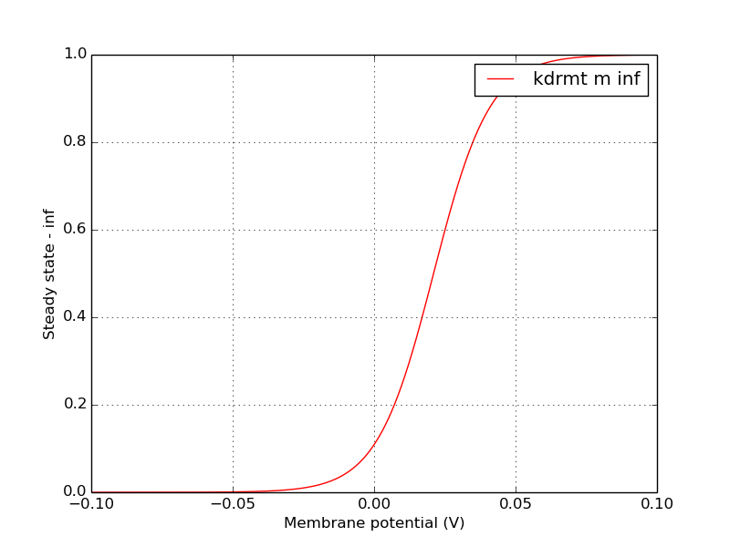
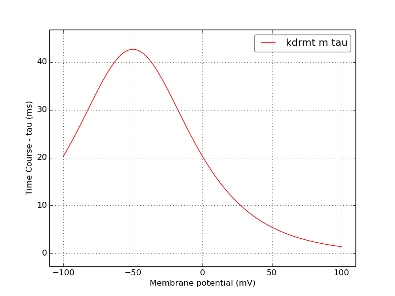
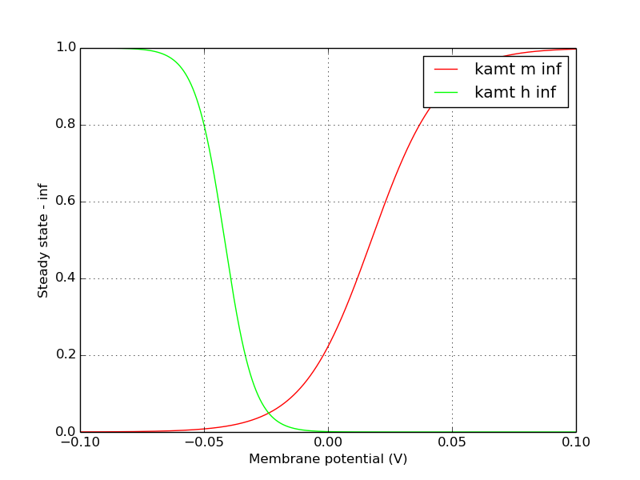
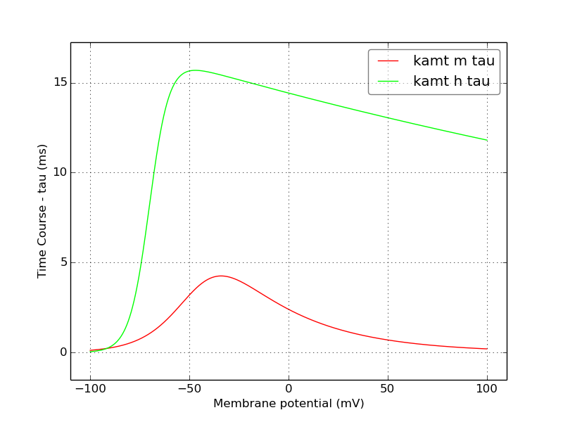

Channel information
===================
    

Channel information at: T = 35.0 degC, E_rev = 0 mV, [Ca2+] = 5e-05 mM

<table>
    <tr>
<td width="120px">
            <b>kdrmt</b> 
            <a href="../kdrmt.channel.nml">kdrmt.channel.nml</a> 
            <b>Ion: k</b> 
            <i>g = gmax * m </i> 
            Delayed rectifier K conductance from Mitral cell model. Comment from original mod file implementation:
        K-DR current for Mitral Cells from Wang et al (1996)
        M.Migliore Jan. 2002
</td>
<td>

</td>
<td>

</td>
</tr>
    <tr>
<td width="120px">
            <b>kamt</b> 
            <a href="../kamt.channel.nml">kamt.channel.nml</a> 
            <b>Ion: k</b> 
            <i>g = gmax * m * h </i> 
            A-type K channel. Comment from the original mod file: K-A current for Mitral Cells from Wang et al (1996)
        M.Migliore Jan. 2002
</td>
<td>

</td>
<td>

</td>
</tr>
</table>

